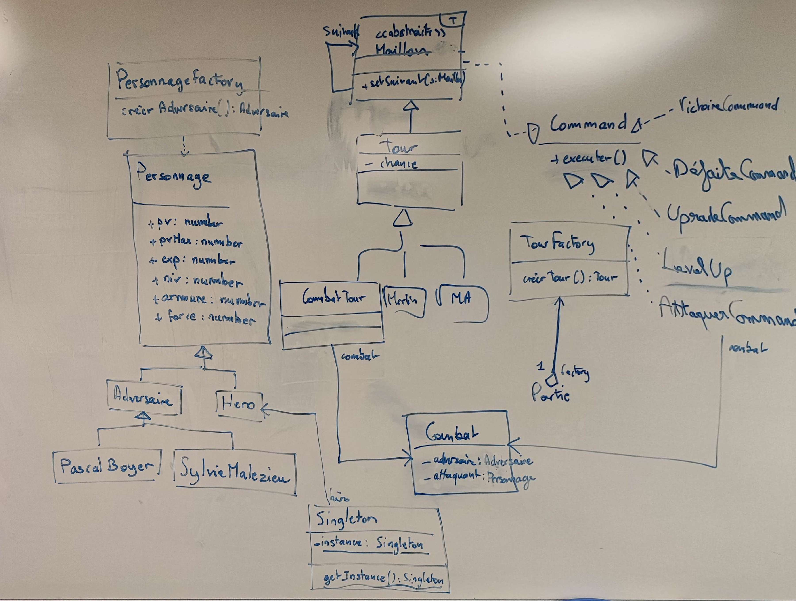
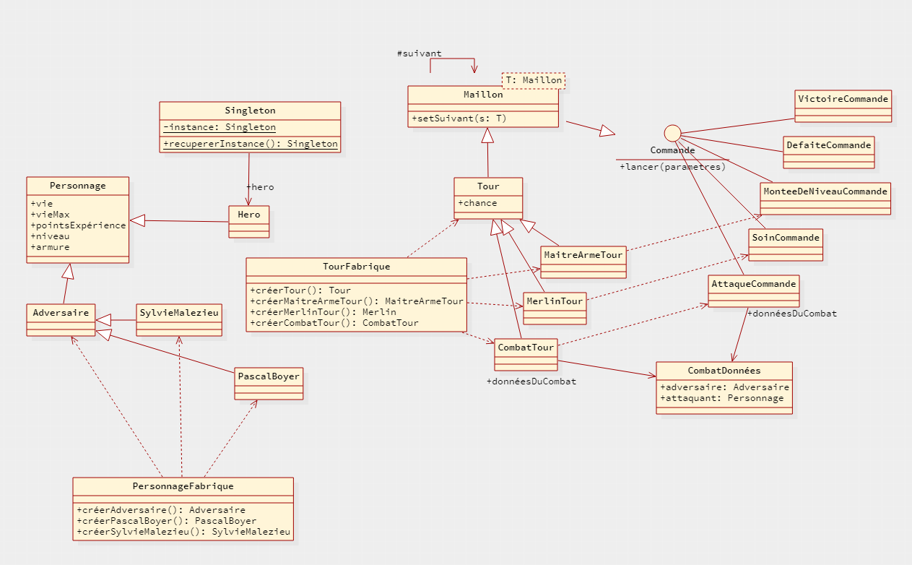

# A la Marrave !

Créé par Elodie LABORDE, Sofiane NASRI, Maïn CHAABEN & Tristan MULLER

## Architecture applicative

### Diagramme de classes

### Patrons de conceptions utilisés

- **Commande** : Patron de conception du même nom permettant de séparer le traitement de son contexte.
- **Maillon/Tour** : Nous avons utilisé le patron de conception "*Chaîne de responsabilité*" pour les tours.
- **Personnage/Tour-Fabrique** : Le patron de conception fabrique est utilisé ici pour tirer des personnages et des tours aléatoirement.
- **Singleton** : Patron de conception du même nom permettant dans notre cas à persister le personnage du héro dans le contexte d'execution de l'application.

## Implémentation

### Génération du code

Grâce au logiciel de conception "*StarUML*", nous avons pu générer les classes non-complétées à partir de notre diagramme de classes.

### Répartition des tâches

Les tâches restantes ont été distribué de manière aléatoire :

 - Main : Implémenter le Personnage, Implémenter la fabrique de personnages, Implémenter les données du combat, Implémenter la commande de soin
 - Tristan : Implémenter le Héro, Implémenter le Tour, Implémenter la fabrique de tours, Implémenter la commande d'attaque
 - Elodie : Implémenter SylvieMalzieu, Implémenter le tour du maitre d'arme, Implémenter le tour de combat, Implémenter la commande de défaite
 - Sofiane : Implémenter PascalBoyer, Implémenter le tour de Merlin, Implémenter la commande de victoire, Implémenter la commande de montée de niveau
